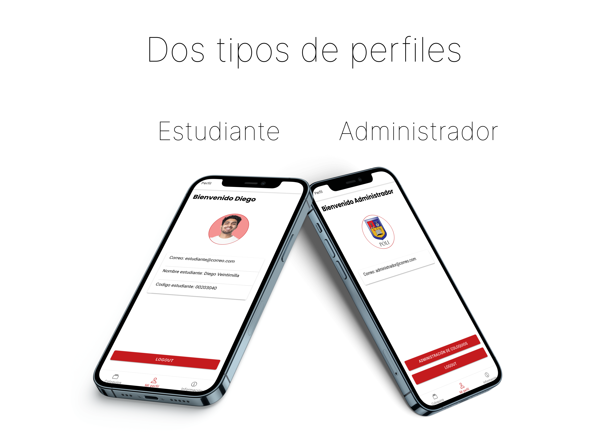
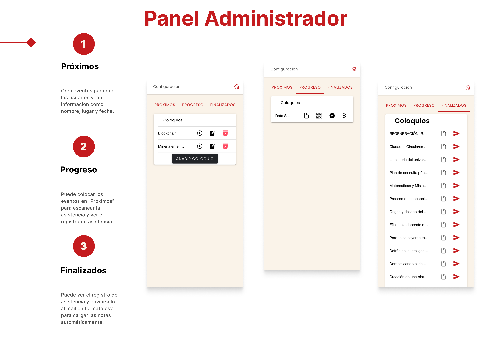
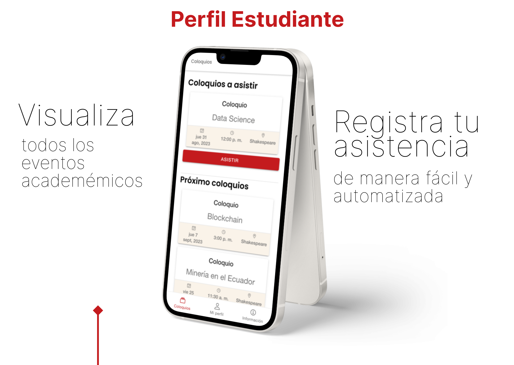
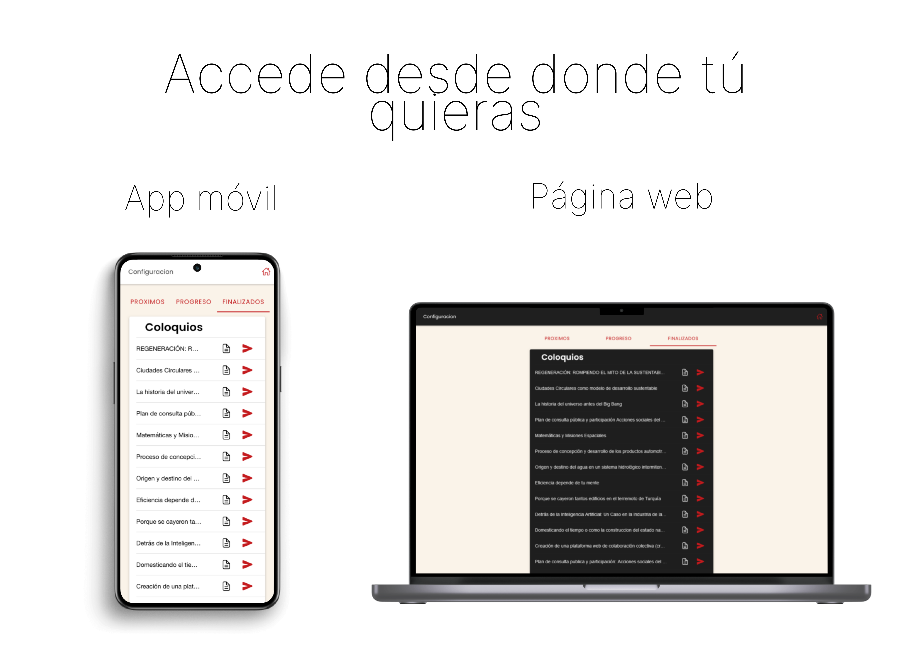

## Why I build this project?
<!-- 
> Tell me and I forget. Teach me and I remember. Involve me and I learn. -->

At my university it is mandatory to attend academic lectures during the whole university period and to complete 40 hours. Due to the large number of students, recording attendance for academic events was a time consuming task. The person in charge of taking attendance used to upload the attendance notes manually, imagine taking attendance for about 150 students every week! I decided to solve this problem by creating this app.

<!-- 
Arcu dui vivamus arcu felis bibendum ut tristique et egestas. Eget gravida cum sociis natoque penatibus. Cras fermentum odio eu feugiat pretium nibh. Proin nibh nisl condimentum id venenatis. Porta nibh venenatis cras sed felis eget velit. Id diam vel quam elementum pulvinar etiam non.

### Level-three heading

Ultrices tincidunt arcu non sodales neque sodales ut. Sed enim ut sem viverra aliquet eget sit amet. Lacus luctus accumsan tortor posuere ac ut consequat semper viverra. Viverra accumsan in nisl nisi scelerisque eu ultrices. In massa tempor nec feugiat nisl pretium fusce.

### Level-three heading

Sed pulvinar porttitor mi in ultricies. Etiam non dolor gravida eros pulvinar pellentesque et dictum ex. Proin eu ornare ligula, sed condimentum dui. Vivamus tincidunt tellus mi, sed semper ipsum pharetra a. Suspendisse sollicitudin at sapien nec volutpat. Etiam justo urna, laoreet ac lacus sed, ultricies facilisis dolor. Integer posuere, metus vel viverra gravida, risus elit ornare magna, id feugiat erat risus ullamcorper libero. Proin vitae diam auctor, laoreet lorem vitae, varius tellus.

Aenean pretium purus augue, ut bibendum erat convallis quis. Cras condimentum quis velit ac mollis. Suspendisse non purus fringilla, venenatis nisl porta, finibus odio. Curabitur aliquet metus faucibus libero interdum euismod. Morbi sed magna nisl. Morbi odio nibh, facilisis vel sapien eu, tempus tincidunt erat. Nullam erat velit, sagittis at purus quis, tristique scelerisque tortor. Pellentesque lacinia tortor id est aliquam viverra. Vestibulum et diam ac ipsum mollis fringilla.

#### Level-four heading

- We noted this
- And also this other point -->
